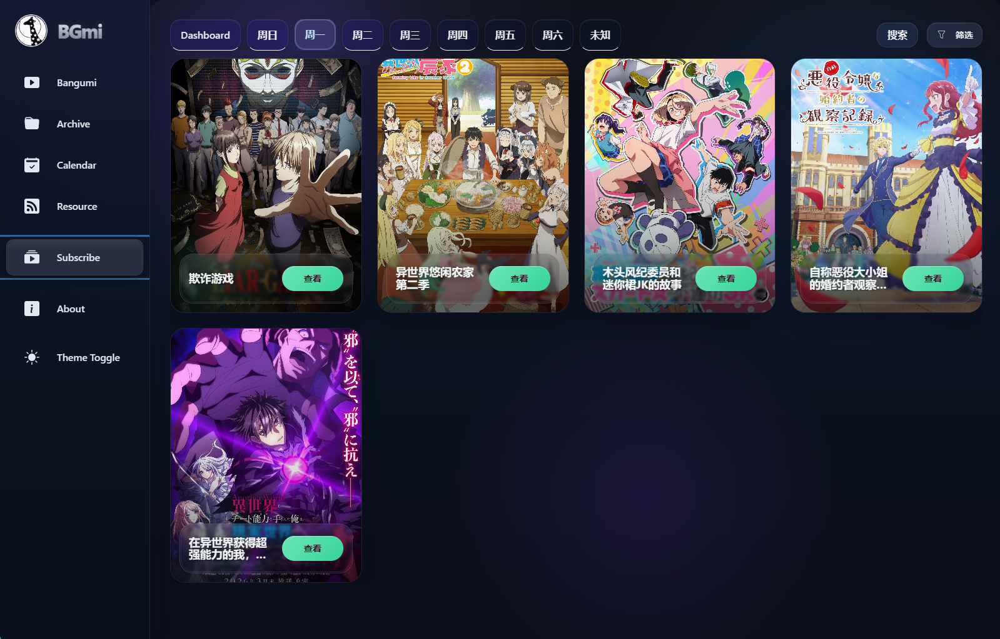

# RTGTX7 BGmi

> 基于官方 [BGmi](https://github.com/BGmi/BGmi) 二次开发的自用增强版：重点补强了 **Bangumi / Archive 页面结构**、**Subscribe Dashboard 管理面板**、**播放器字幕与多画质链路**、以及 **Docker 一体化部署体验**。

<p>
  
  
  
  
</p>

---

## 目录

- [项目定位](#项目定位)
- [界面预览](#界面预览)
- [当前版本增强点](#当前版本增强点)
- [页面说明](#页面说明)
- [快速开始：Docker 部署](#快速开始docker-部署)
- [首次使用建议流程](#首次使用建议流程)
- [常用维护命令](#常用维护命令)
- [本地开发](#本地开发)
- [项目结构](#项目结构)
- [相关文档](#相关文档)

---

## 项目定位

这个仓库不是官方 BGmi 的纯镜像，而是一个 **可长期维护的自定义版本**。  
适合以下场景：

- 想保留 BGmi 的订阅 / 下载 / 资源管理能力
- 想把 UI 改成更现代的 Bangumi 媒体库体验
- 需要 **当季新番** 与 **历史季度归档** 分离浏览
- 希望在 `Subscribe` 里直接做维护操作，而不是全靠命令行
- 需要一个带 **多画质 / 字幕 / HLS / 移动端手势** 的网页播放器
- 想直接部署为自己的 Docker 镜像并长期迭代

---

## 界面预览

### Bangumi / 当季新番

<p align="center">
  
</p>

### Subscribe / 订阅页

<p align="center">
  
</p>

> 说明：截图可能与最新小版本存在轻微差异，但整体交互方向一致。

---

## 当前版本增强点

### 1. Bangumi / Archive 页面重构

- `Bangumi` 页面只聚焦 **当季新番**
- 历史季度独立到 `Archive / 往期番剧`
- 支持季度预览、季度详情、历史季度浏览
- 桌面端海报网格会根据宽度自适应，减少右侧空白
- 移动端标题区和入口层级做了单独优化

### 2. Subscribe Dashboard

- 在 `Subscribe` 页面中新增独立 `Dashboard` 标签
- 提供：
  - 数据概览
  - 异常诊断
  - Command Center 维护操作
- 已集成的维护动作包括：
  - 重新同步 Mikan 数据
  - 检查异常数据
  - 重建仓库番剧
  - 剧集全部清零
  - 提交下载任务
  - 更新剧集和海报
- 高风险操作保留二次确认 / double check 逻辑

### 3. 播放器增强

- 使用 **Artplayer + HLS.js**
- 默认自动挂载可用字幕
- 支持多字幕与字幕切换
- `ASS/SSA` 使用 `ass.js`，降低 CJK 字体显示问题
- 画质切换：
  - `Direct Play`
  - `1080p HLS`
  - `1080p 5M`
  - `720p 3M`
- 移动端手势增强：
  - 轻点显示 / 隐藏控制栏
  - 长按 2x 倍速
  - 屏蔽 Chrome 原生长按下载菜单

### 4. Docker 一体化

- 多阶段构建：前端构建 + Python 后端运行时
- 首次启动自动执行 `bgmi install`
- 自动把前端构建产物复制到运行目录
- 内置定时任务：
  - `bgmi update --download`
  - `bgmi cal --force-update --download-cover`
- 可直接发布自己的镜像版本

---

## 页面说明

| 页面 | 作用 |
| --- | --- |
| `Bangumi` | 当前季度新番主页，适合日常追番 |
| `Archive / 往期番剧` | 历史季度归档页，按季度查看往期番剧 |
| `Calendar` | 按星期 / 日期查看更新安排 |
| `Resource` | 资源、下载与可播放内容入口 |
| `Subscribe` | 订阅番剧列表、移动端卡片、Dashboard 管理面板 |
| `Player` | 多画质、字幕、HLS、移动端长按 2x 播放器 |

---

## 快速开始：Docker 部署

### 方式 A：直接使用已发布镜像

```bash
docker run -d \
  --name bgmi-custom \
  -p 8899:8899 \
  -e TZ=America/Toronto \
  -e BGMI_ADMIN_TOKEN=change-me \
  -v $(pwd)/docker-data:/data \
  --restart unless-stopped \
  rtgtx7/bgmi-custom:latest
```

启动后访问：

- `http://127.0.0.1:8899`
- 局域网访问：`http://你的主机IP:8899`

### 方式 B：使用仓库自带 `docker-compose.yml`

```bash
git clone https://github.com/RTGTX7/BGmi.git
cd BGmi
docker compose up -d
```

默认配置：

- 镜像：`rtgtx7/bgmi-custom:latest`
- 端口：`8899`
- 数据目录：`./docker-data`

目录大致会变成：

```text
docker-data/
├─ .bgmi/     # BGmi 配置、数据库、前端静态文件
├─ bangumi/   # 番剧资源与媒体文件
└─ tmp/       # 临时文件 / 转码缓存
```

### 可选：指定 GPU

如果你要固定某张 NVIDIA GPU：

```bash
docker compose -f docker-compose.yml -f docker-compose.gpu.yml up -d
```

可配环境变量：

- `NVIDIA_GPU_ID=0`
- `NVIDIA_VISIBLE_DEVICES=all`
- `NVIDIA_DRIVER_CAPABILITIES=compute,video,utility`

> 如果你是纯 CPU 环境，可自行删掉或调整 compose 里的 NVIDIA 设备预留配置。

---

## 首次使用建议流程

1. **启动容器**
   - 首次启动时会自动初始化 BGmi
   - 同时复制前端构建文件到运行目录

2. **打开 Web 页面**
   - 地址：`http://你的主机IP:8899`

3. **配置管理员 Token**
   - 通过环境变量 `BGMI_ADMIN_TOKEN` 指定
   - 页面需要写操作时，使用这个 token 即可

4. **同步番剧与海报**
   - 可以通过 Dashboard 执行
   - 或使用命令：
     - `bgmi cal --force-update --download-cover`

5. **订阅番剧**
   - 在 `Subscribe` 页面管理订阅
   - 可按星期查看，也可在 `Dashboard` 执行维护操作

6. **提交下载**
   - Dashboard 中使用：
     - `提交下载任务`
   - 对应后端命令：
     - `bgmi update --download`

7. **播放器观看**
   - 进入 `Player`
   - 选择画质 / 字幕 / HLS 档位
   - 手机端支持轻点呼出控制栏、长按 2x

---

## 常用维护命令

如果你要在容器里手动执行：

```bash
docker exec -it bgmi-custom bgmi update --download
```

```bash
docker exec -it bgmi-custom bgmi cal --force-update --download-cover
```

### 更新到最新镜像

```bash
docker compose pull
docker compose up -d
```

如果你使用 `docker run`，可以先停止旧容器，再重新拉起：

```bash
docker pull rtgtx7/bgmi-custom:latest
```

### 定时任务

容器启动后默认会后台执行：

- 每 **30 分钟**：
  - `bgmi update --download`
- 每 **4 小时**：
  - `bgmi cal --force-update --download-cover`

可通过环境变量调整：

| 变量 | 默认值 | 说明 |
| --- | --- | --- |
| `BGMI_UPDATE_INTERVAL` | `1800` | 自动下载任务提交间隔，单位秒 |
| `BGMI_CAL_INTERVAL` | `14400` | 日历/海报刷新间隔，单位秒 |
| `BGMI_ADMIN_TOKEN` | 无 | 管理员操作 token |
| `BGMI_PORT` | `8899` | 对外暴露端口（compose 中使用） |
| `TZ` | `America/Toronto` | 时区 |

---

## 从源码构建自己的镜像

```bash
git clone https://github.com/RTGTX7/BGmi.git
cd BGmi
docker build -t rtgtx7/bgmi-custom:dev .
```

构建完成后运行：

```bash
docker run -d \
  --name bgmi-custom-dev \
  -p 8899:8899 \
  -e BGMI_ADMIN_TOKEN=change-me \
  -v $(pwd)/docker-data:/data \
  rtgtx7/bgmi-custom:dev
```

---

## 本地开发

仓库已经补好了适合 Windows PowerShell 的本地开发脚本。

### 1. 初始化依赖

```powershell
cd C:\Users\rtgtx\Desktop\bgmi
powershell -ExecutionPolicy Bypass -File .\scripts\dev-setup.ps1
```

这一步会：

- 在 `BGmi/.venv` 创建 Python 虚拟环境
- 以 editable 模式安装后端
- 安装前端 `pnpm` 依赖

### 2. 启动后端

```powershell
cd C:\Users\rtgtx\Desktop\bgmi
powershell -ExecutionPolicy Bypass -File .\scripts\dev-backend.ps1
```

后端地址：

- `http://127.0.0.1:8888`

### 3. 启动前端

```powershell
cd C:\Users\rtgtx\Desktop\bgmi
powershell -ExecutionPolicy Bypass -File .\scripts\dev-frontend.ps1
```

前端地址：

- `http://127.0.0.1:5173`

### 4. 一键拉起

```powershell
cd C:\Users\rtgtx\Desktop\bgmi
powershell -ExecutionPolicy Bypass -File .\scripts\dev.ps1
```

### 开发说明

- 前端通过 Vite HMR 热更新
- 后端通过 Tornado debug 自动重载
- 本地开发时前端会代理 `/api`、`/bangumi`、`/resource`
- 可编辑前端源码目录：`BGmi-frontend/`
- 运行时静态文件目录：`BGmi/.bgmi/front_static/`

---

## 项目结构

```text
.
├─ BGmi/                 # 后端源码（基于官方 BGmi 定制）
├─ BGmi-frontend/        # 前端源码（Vite + React + Chakra UI）
├─ scripts/              # 本地开发脚本
├─ images/              # 图片
├─ docker-compose.yml    # 常规容器启动
├─ docker-compose.gpu.yml# GPU 覆盖配置
├─ Dockerfile            # 多阶段构建镜像
├─ docker-entrypoint.sh  # 运行时初始化与定时任务
├─ CHANGELOG.md          # 变更记录

```

---

## 相关文档

- [CHANGELOG.md](./CHANGELOG.md)
- [MAINTENANCE.md](./MAINTENANCE.md)
- [GITHUB_SETUP.md](./GITHUB_SETUP.md)

---

## 维护说明

- `origin/main` 视为当前自定义稳定分支
- 官方项目建议作为独立 upstream 跟踪，不要直接覆盖
- 若你长期维护这个版本，建议把：
  - 后端改动
  - 前端 UI 改动
  - Docker 部署层
  
  分开思考和提交，后续更容易同步官方修复

---

## 当前推荐

如果你只是想直接部署并用起来，最推荐：

1. 直接拉 `rtgtx7/bgmi-custom:latest`
2. 配好 `BGMI_ADMIN_TOKEN`
3. 先跑一次海报/日历刷新
4. 再通过 `Subscribe Dashboard` 做下载和维护

如果你想继续深度定制，这个仓库已经适合作为你的长期维护底座。
